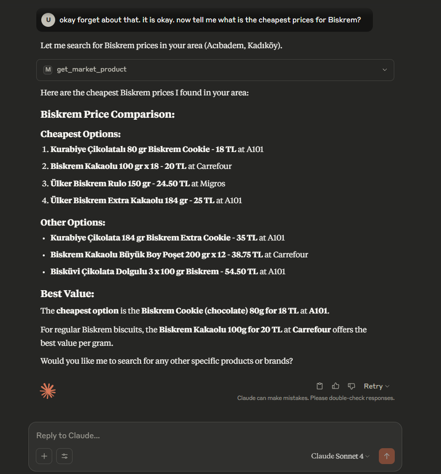
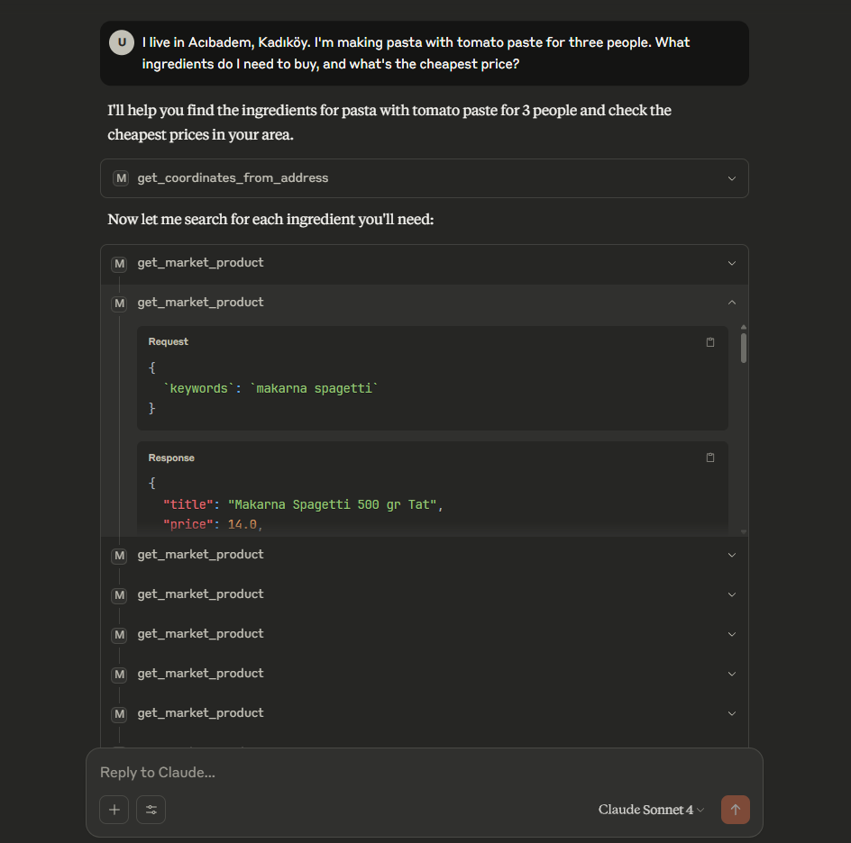
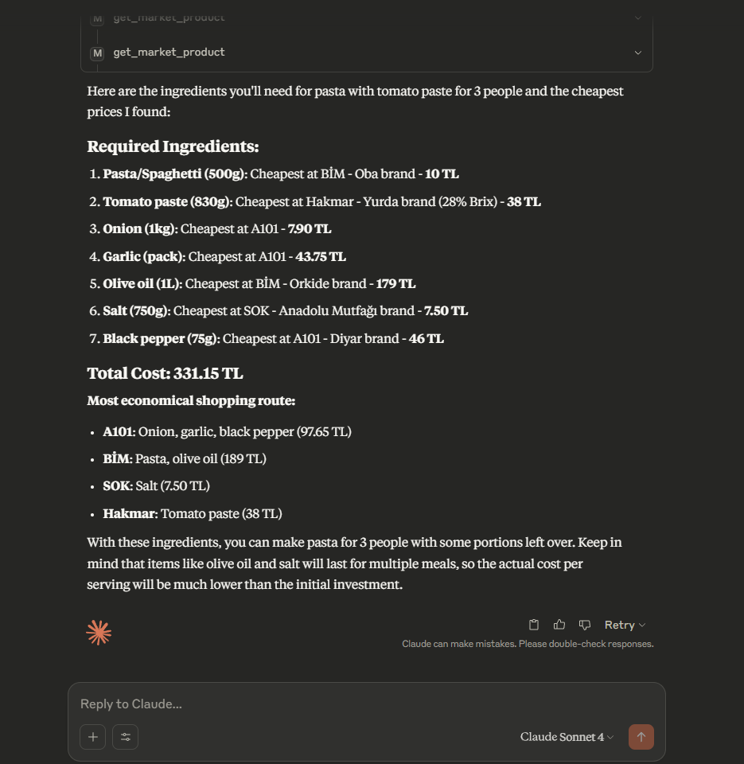
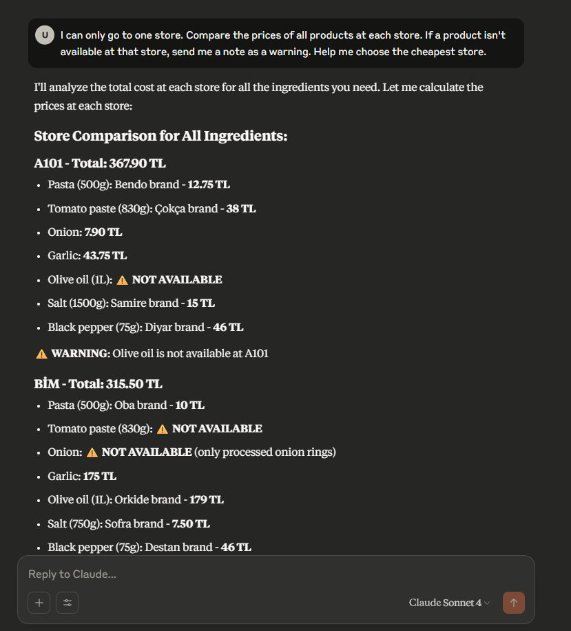
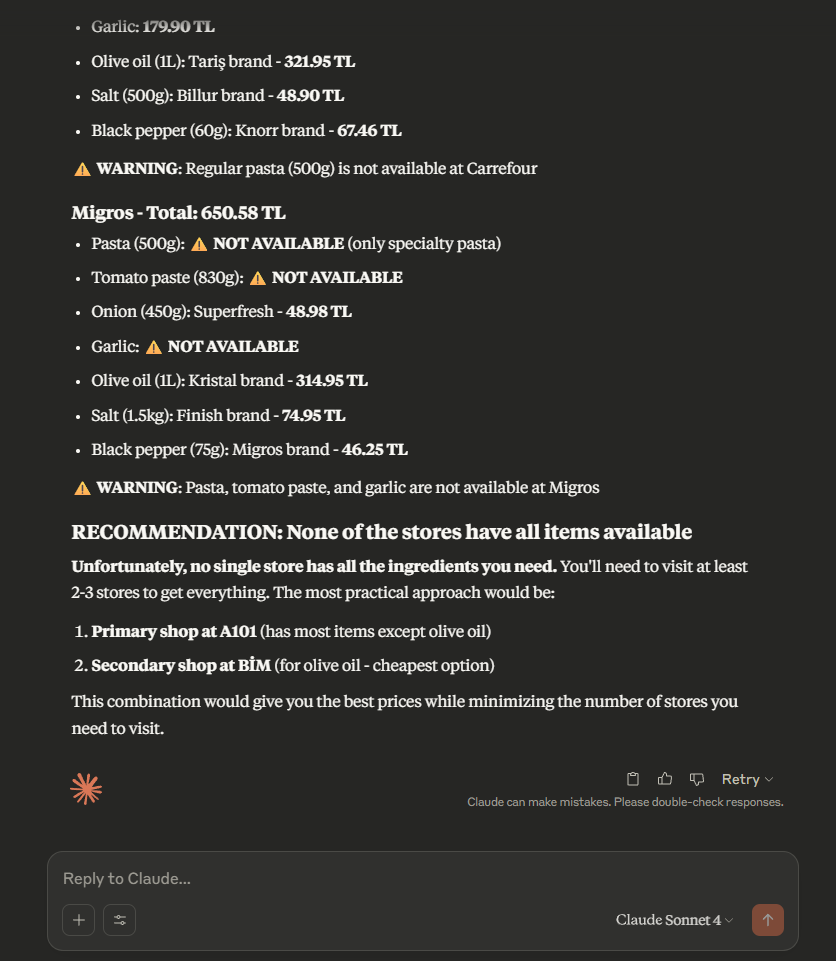

# Market Price Finder MCP (Turkey)

Market Price Finder **Model Context Protocol (MCP)** is a tool that helps users find and compare real-time prices of products in various Turkish markets (Migros, A101, Bim, etc.) based on natural language queries that include both product name and location. It leverages the Model Context Protocol for integration and automation.

## What Does This Project Do?
- **Converts natural language prompts** (e.g., "Başakşehir'de süt fiyatı nedir?") into actionable product and location searches.
- **Geocodes locations** using OpenStreetMap Nominatim to obtain latitude and longitude from user-provided addresses.
- **Queries the MarketFiyati.org.tr API** to fetch real-time product prices from nearby markets.
- **Returns a list of products** with their title, lowest price, and the market offering that price.

## Technology Stack
- **Python 3.10+**
- **[FastMCP](https://github.com/modelcontext/fast-mcp)**: For building the MCP tool interface
- **[httpx](https://www.python-httpx.org/)**: For asynchronous HTTP requests
- **OpenStreetMap Nominatim API**: For geocoding location strings
- **MarketFiyati.org.tr API**: For product price search

## Project Structure
- `main.py` — Entry point for running the MCP server
- `marketfinder.py` — Core logic for prompt parsing, geocoding, and market price search
- `parser_utils.py` — Utility for parsing natural language prompts
- `pyproject.toml` — Project dependencies and configuration

## Setup Instructions

### 1. Clone the Repository
```sh
git clone https://github.com/robuno/market-price-finder-mcp-tr
cd market-price-finder-mcp-tr
```

### 2. Create and Activate a Virtual Environment
On Windows:
```sh
python -m venv .venv
.venv\Scripts\activate
```
On macOS/Linux:
```sh
python3 -m venv .venv
source .venv/bin/activate
```

### 3. Install Dependencies
```sh
uv pip install -r requirements.txt
```
Or, if using `pyproject.toml`:
```sh
uv pip install
```

### 4. Run the MCP Tool
```sh
uv run marketfinder.py
```
Or directly:
```sh
python marketfinder.py
```

## Usage
- Interact with the tool via MCP-compatible clients or by sending prompts directly.
- Example prompts:
  - `Başakşehir'de süt fiyatı nedir?`
  - `How much do eggs cost in Acıbadem Mahallesi Kadıköy? ?`
- The tool will return a list of products with their title, lowest price, and the market name.

## Integrating with Claude for Desktop

To use this MCP server with Claude for Desktop, you need to add a configuration entry to your Claude Desktop config file. **Be sure to use your own project directory path in the configuration!**

Add the following to your `claude_desktop_config.json`:

```json
"market-finder": {
  "command": "uv",
  "args": [
    "--directory",
    "<your-full-project-directory>",
    "run",
    "marketfinder.py"
  ]
}
```

Replace `<your-full-project-directory>` with the absolute path to your `market-price-finder-mcp-tr` directory.

### How to Edit the Config File

- **Windows:**
  - Open a terminal and run:
    ```powershell
    code $env:AppData\Claude\claude_desktop_config.json
    ```
    (This opens the config file in VS Code. Create the file if it doesn't exist.)
- **Linux:**
  - Open a terminal and run:
    ```sh
    code $HOME/.config/Claude/claude_desktop_config.json
    ```
    (Or open with your preferred editor. Create the file if it doesn't exist.)
- **macOS:**
  - Open a terminal and run:
    ```sh
    code "$HOME/Library/Application Support/Claude/claude_desktop_config.json"
    ```
    (Or open with your preferred editor. Create the file if it doesn't exist.)

> **Note:** Claude for Desktop is not yet available on Linux. Linux users can proceed to the "Building a client" tutorial to build an MCP client that connects to the server.

For more information, see the [Claude for Desktop documentation](https://docs.anthropic.com/claude/docs/claude-for-desktop#testing-your-server-with-claude-for-desktop).

---

For more information, see the source code and comments in `marketfinder.py`.

## Example Responses

Below are example responses and screenshots of the tool in action:










